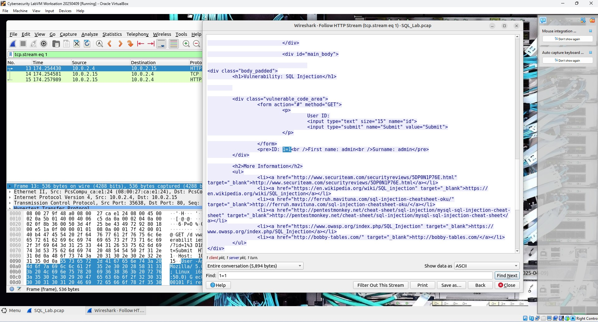
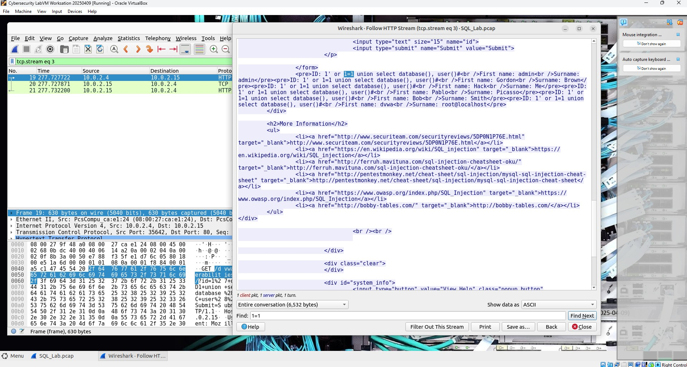
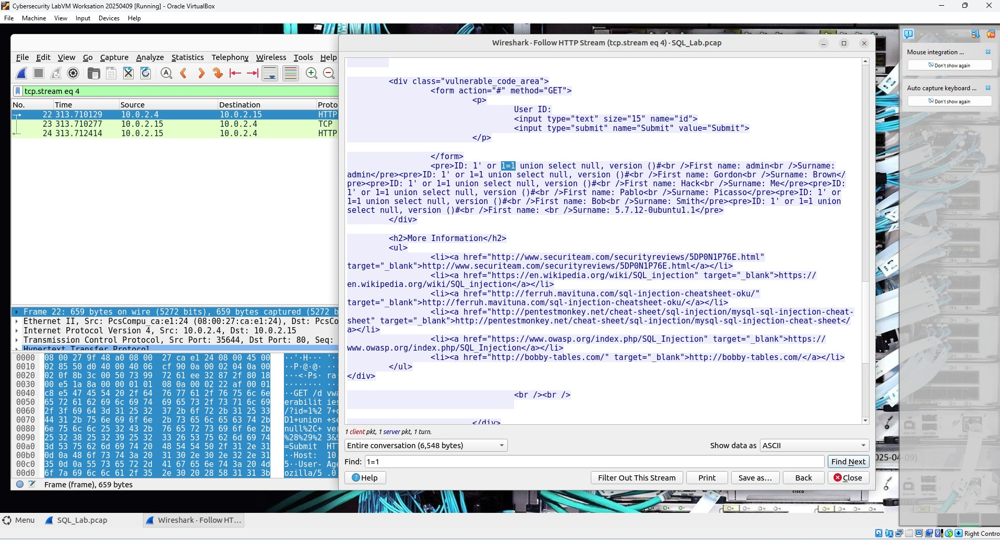

# SQL Injection Analysis via Wireshark  
_(Cisco Networking Academy (NetAcad) – Endpoint Security course – Enterprise Services – 4.2.8. Lab: Attacking a MySQL Database)_

This lab is part of the **Endpoint Security** course in Cisco’s *Junior Cybersecurity Analyst* learning path.  
It focuses on analyzing a SQL Injection attack captured in a `.pcap` file using Wireshark.

---

## Objective

- Analyze captured HTTP traffic containing SQL injection payloads
- Understand how attackers use SQL logic (`1=1`, `UNION SELECT`, etc.) to bypass authentication and extract data
- Practice identifying malicious queries and interpreting their results

---

## Tools

- **Cybersecurity LabVM Workstation 20250409** (official Cisco NetAcad VM image)
- **Wireshark**
- **PCAP file:** `SQL_Lab.pcap`  
  Located at: `/home/analyst/lab.support.files/SQL_Lab.pcap`

> **Personal note/reflection:**  
> The `.pcap` was pre-generated. My task was to analyze it, not to capture it live.

---

## Steps

### Opening the PCAP
- Open Wireshark
- Load `SQL_Lab.pcap`
- The capture lasts ~441 seconds (about 8 minutes)

> **Observation:**  
> Two IP addresses are involved – the attacker and the victim.

---

### Detecting the Injection Test

- Packet **#13** → Right-click → Follow > HTTP Stream  
- Payload observed:
  ```
  UserID=1' OR 1=1 --
  ```
- The attacker inserted this query into a `UserID` field in the web application. This is a basic test for SQL injection vulnerabilities.

- Instead of the application rejecting the input with an error or login failure message, it **responded with a valid record from the database** — specifically a user entry with `First name: admin`, `Surname: admin`.

- Why? Because `1=1` is always true – it's a classic trick to manipulate the logic behind login checks. The SQL query behind the scenes ends up looking like:  
  ```sql
  SELECT * FROM users WHERE UserID = '1' OR 1=1 --';
  ```
  Which means: "give me all users where ID is 1 **or just anything that's always true**". The `--` tells SQL to ignore the rest of the line (it's a comment).

- This confirms that the application is **vulnerable to SQL injection**, and the attacker now knows the input is not being sanitized or protected.

> **Learning note:**  
> `1=1` is a tautology – it always evaluates to true. When injected into a query, it bypasses login logic.  
> The double dash `--` is a SQL comment, which effectively disables the rest of the query.

The screenshot below shows the result of the SQL injection test (`1=1`) in packet 13.  
The application returned a valid user record (`admin`), proving the input was executed as part of a backend SQL query.



---

### Extracting Database Information

- Packet **#19** → Follow HTTP Stream  
- Payload:
  ```
  1' OR 1=1 UNION SELECT database(), user() #
  ```
- The attacker escalates their input by asking the database to reveal its name and current user.
- The `UNION SELECT` part lets the attacker add their own query to the original one. If the application is vulnerable, the results from that added query show up right in the web page response.

- The server returns multiple rows containing values such as:
  - `First name: dvwa`
  - `Surname: root@localhost`
- This confirms that the **database name** is `dvwa`, and the **user currently connected** is `root@localhost`. These are valuable pieces of information that an attacker can use to understand the database structure or privileges.

> **Learning note:**  
> The `UNION SELECT` technique is one of the most common ways to extract backend metadata.  
> When it works, the attacker can often see the results directly in the application response — like database name, user, or even table content.

The screenshot below captures the full response from the server after the `UNION SELECT` injection in stream 3:



---

### Revealing System Version

- Packet **#22** → Follow HTTP Stream  
- Payload:
  ```
  1' OR 1=1 UNION SELECT NULL, version() #
  ```
- This request is trying to reveal which database is being used and what version it is. The attacker wants to know exactly what’s running behind the scenes, so they can look for known weaknesses or vulnerabilities.

- In the response, the application outputs:
  ```
  5.7.12-0ubuntu1.1
  ```
- This value is enough to identify the MySQL version — a useful piece of information for further targeted attacks or exploit compatibility.

> **Learning note:**  
> This is a classic use of `version()` – a built-in function in many SQL engines.  
> It might not seem dangerous at first, but showing the database version can actually help attackers figure out what kind of exploits might work.

Screenshot from stream 4:



---

## Summary Table

| Step | Payload | Purpose | Outcome |
|------|---------|---------|---------|
| #13  | `1=1` | Test for injection | Login skipped, user data displayed |
| #19  | `UNION SELECT database(), user()` | Extract DB info | Partial success (database name `dvwa` appears) |
| #22  | `UNION SELECT NULL, version()` | Reveal version | Version string `5.7.12-0ubuntu1.1` exposed |

---

> **Personal note/reflection:**  
> This was my first time dissecting an actual SQL injection attack in Wireshark.  
> I already knew the theory, but following the attacker’s logic stream-by-stream helped me see how these attacks unfold in real time.  
> It also showed how easy it is to pull sensitive data if input sanitization is missing.  
>  
> The lab helped me better understand:
> - Why web input fields need to be validated
> - How HTTP traffic reveals so much during forensic analysis
> - The power of Wireshark in tracing complex behavior from a few key packets
